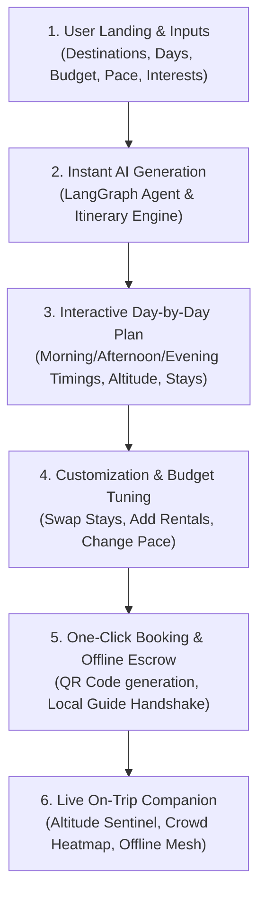

# 🗺️ AI Travel Planner — End-to-End Workflow & Architecture

> **Discovery Uttarakhand — Intelligent Himalayan Travel Engine**  
> Complete operational breakdown: User Journey, AI Orchestration, RAG Retrieval, Deterministic Budgeting, and On-Trip Safety Handshake.

---

## 🧭 1. Executive Summary & Core Philosophy

The AI Travel Planner is not a simple chat bot or generic LLM wrapper. It is a **Hybrid Agentic Workflow** combining:
1. **Deterministic Logic:** Rigorous mountain road timings, elevation checks, verified KMVN/GMVN homestays, and transparent budget math.
2. **LangGraph State Machine (`ai/app`):** Multi-step graph agent for intent classification, slot-filling, and tool synthesis.
3. **Database-First Retrieval:** Prioritizes local MongoDB/Vector knowledge bases (90% of queries) with automatic real-time web search fallback for latest weather, road blocks, or temple schedules (10%).
4. **On-Trip Continuity:** Converts generated itineraries into offline QR codes, biometric escrow handshakes, and mesh SOS safety cards.

---

## 🚶‍♂️ 2. Complete User Journey ("User Ke Perspective Se Flow")



---

### Step 1: User Input & Preference Gathering (`TripPlanner.jsx`)
* **Entry Point:** [`TripPlanner.jsx`](file:///c:/Users/Deepanshu/Desktop/discover/Frontend/src/pages/TripPlanner.jsx)
* **User Actions:**
  * Selects **Starting City** (e.g., Delhi, Dehradun, Haridwar, Kathgodam).
  * Selects **Destination Region** (e.g., Kedar Valley, Auli-Joshimath, Munsyari, Valley of Flowers, Nainital).
  * Chooses **Trip Duration** (e.g., 3 Days, 5 Days, 7 Days) and **Travel Dates**.
  * Sets **Group Type & Travelers** (Solo, Couple, Family with Elders, Adventure Squad).
  * Selects **Budget Tier** (Budget / Homestay, Moderate / KMVN, Luxury / Boutique Eco-Resort).
  * Chooses **Vibe & Interests** (Spiritual & Temples, High-Altitude Trekking, Local Culture & Food, Photography, Hidden Offbeat Gems).
  * Selects **Pace** (Relaxed, Balanced, Fast-Paced).

---

### Step 2: Agent Orchestration & Real-Time Synthesis
* When the user clicks **"Generate Himalayan Itinerary"**:
  1. Frontend dispatches request to [`agentService.js`](file:///c:/Users/Deepanshu/Desktop/discover/backend/services/agentService.js) / LangGraph runtime (`ai/app/agent/graph.py`).
  2. **Slot Analysis & Intent Resolution:** Validates feasible daily drive times (e.g., avoids recommending 10-hour night drives in Garhwal hills).
  3. **Tool Execution:** Fetches verified homestays from local DB, road advisories from live telemetry, and calculates daily per-person budgets.
  4. **Output Generation:** Builds a structured JSON day-by-day itinerary object with morning, afternoon, evening activities, stay recommendations, meal spots, and altitude acclimation checkpoints.

---

### Step 3: Interactive Itinerary Exploration & Customization
* **UI Component:** [`DayCard.jsx`](file:///c:/Users/Deepanshu/Desktop/discover/Frontend/src/components/planner/DayCard.jsx) & [`TripPlanner.jsx`](file:///c:/Users/Deepanshu/Desktop/discover/Frontend/src/pages/TripPlanner.jsx)
* **What the User Sees:**
  * **Interactive Map:** Route rendered via Leaflet/Mapbox showing elevation profile, drive segments, and stops.
  * **Day Cards:**
    * 🌅 **Morning (07:00 - 11:00 AM):** Departure, scenic viewpoints, breakfast at local dhabas (e.g., Maggi & Pahadi Chai points).
    * ☀️ **Afternoon (12:00 - 04:00 PM):** Main sightseeing/trekking, lunch, temple visits.
    * 🌙 **Evening (05:00 - 09:00 PM):** Sunset vantage point, village walk, local Garhwali/Kumaoni dinner (Kafuli, Bhatt ki Churkani).
    * 🏡 **Verified Stay Recommendation:** Direct KMVN/GMVN or local homestay card with pricing and direct booking trigger.
  * **Altitude & Safety Badges:** Identifies spots above 8,000 ft and injects hydration/acclimatization alerts (e.g., Chopta, Tungnath, Badrinath).
  * **Edit & Swap Controls:** User can click to replace any stay, add bike/car rentals, or regenerate a single day with different interests.

---

### Step 4: Budget Breakdown & Deterministic Cost Estimation
* **Engine:** [`budgetEngine.js`](file:///c:/Users/Deepanshu/Desktop/discover/backend/services/budgetEngine.js)
* Transparent cost summary broken into 4 buckets:
  1. 🏨 **Accommodation:** Homestays / Camps / Hotels (₹X per night).
  2. 🚗 **Transport & Fuel:** Private taxi / Self-drive 4x4 / Shared Sumo / Scooty rental.
  3. 🍲 **Food & Dining:** Local dhabas and homestay thalis (₹Y per day).
  4. 🎟️ **Permits & Activities:** Forest entry fees, guide charges, temple darshan tokens.
* **No hidden surcharges:** 100% price breakdown with dynamic group split calculator.

---

### Step 5: Save, Export & Offline Escrow Handshake
* **UI Component:** [`OfflineEscrowHandshake.jsx`](file:///c:/Users/Deepanshu/Desktop/discover/Frontend/src/components/OfflineEscrowHandshake.jsx) & [`MyTripPage.jsx`](file:///c:/Users/Deepanshu/Desktop/discover/Frontend/src/pages/MyTripPage.jsx)
* **Offline-First Travel Execution:**
  * User can click **"Save to My Trips"** or **"Download Offline Pass (PDF & QR)"**.
  * Generates an **Offline Cryptographic QR Code** containing booking vouchers, emergency contacts, medical profile, and itinerary.
  * When reaching no-signal mountain valleys (e.g., Bhojwasa or Munsyari), the user shows the QR code to the homestay host or local guide for a zero-internet escrow check-in.

---

### Step 6: Live On-Trip Co-Pilot & Safety Sentinel
* **UI Components:**
  * [`AltitudeSafetyAI.jsx`](file:///c:/Users/Deepanshu/Desktop/discover/Frontend/src/components/AltitudeSafetyAI.jsx): Live AMS (Acute Mountain Sickness) risk calculation based on GPS elevation climb rate.
  * [`LiveMountainTelemetry.jsx`](file:///c:/Users/Deepanshu/Desktop/discover/Frontend/src/components/LiveMountainTelemetry.jsx): Real-time weather, landslide alerts, and crowd heatmap.
  * [`CommunitySafetyGrid.jsx`](file:///c:/Users/Deepanshu/Desktop/discover/Frontend/src/components/CommunitySafetyGrid.jsx): SOS emergency mesh network broadcasting to local SDRF / GMVN checkpoints.
  * [`AICopilotDrawer.jsx`](file:///c:/Users/Deepanshu/Desktop/discover/Frontend/src/components/AICopilotDrawer.jsx): 24/7 Pahadi voice/text assistant capable of modifying plans mid-trip ("Heavy rain in Joshimath, redirect me to a safe valley").

---

## ⚙️ 3. Technical Architecture & Data Pipeline

```
[ Frontend: React 18 + Vite + Tailwind (Port 5173) ]
                     │
                     ▼  REST / WebSocket
[ Node.js Backend: Express + MongoDB (Port 5000) ]
  ├── agentController.js  ─── Dispatcher & Validation
  ├── agentTools.js       ─── 8 Grounded Local Tools
  ├── budgetEngine.js     ─── Deterministic Cost Math
  └── recommendationService.js
                     │
                     ▼  Async Microservice Proxy
[ Python AI Runtime: FastAPI + LangGraph + Gemini (Port 8000) ]
  ├── graph.py            ─── State Graph (Understand -> Tools -> RAG -> Synthesize)
  ├── rag/retriever.py    ─── ChromaDB / Vector Search (Uttarakhand Knowledge)
  └── tools/search.py     ─── Real-Time Web Search Fallback
```

### Key Modules & File Mapping:

| Module | File Location | Core Responsibility |
| :--- | :--- | :--- |
| **Frontend Planner UI** | [`TripPlanner.jsx`](file:///c:/Users/Deepanshu/Desktop/discover/Frontend/src/pages/TripPlanner.jsx) | User interface for inputs, visual itinerary, budget charts, and route maps |
| **Day Card Renderer** | [`DayCard.jsx`](file:///c:/Users/Deepanshu/Desktop/discover/Frontend/src/components/planner/DayCard.jsx) | Renders morning, afternoon, evening cards, stay tags, and timing estimates |
| **AI Copilot Drawer** | [`AICopilotDrawer.jsx`](file:///c:/Users/Deepanshu/Desktop/discover/Frontend/src/components/AICopilotDrawer.jsx) | Slide-over AI companion for on-the-fly questions and plan modifications |
| **Backend Agent Service** | [`agentService.js`](file:///c:/Users/Deepanshu/Desktop/discover/backend/services/agentService.js) | Node.js LLM integration, prompt injection, and tool calling orchestration |
| **Agent Grounding Tools** | [`agentTools.js`](file:///c:/Users/Deepanshu/Desktop/discover/backend/services/agentTools.js) | Real database queries for homestays, rentals, road conditions, and web search fallback |
| **LangGraph Multi-Agent** | [`ai/app/agent/graph.py`](file:///c:/Users/Deepanshu/Desktop/discover/ai/app/agent/graph.py) | Python state machine for complex multi-turn reasoning and travel synthesis |
| **Deterministic Budget** | [`budgetEngine.js`](file:///c:/Users/Deepanshu/Desktop/discover/backend/services/budgetEngine.js) | Fixed mathematical formulas for fuel, stays, permits, and food splits |
| **Offline QR Escrow** | [`OfflineEscrowHandshake.jsx`](file:///c:/Users/Deepanshu/Desktop/discover/Frontend/src/components/OfflineEscrowHandshake.jsx) | Zero-connectivity verification and biometric handshake for local hosts |

---

## 🔒 4. The "Anti-Hallucination" Grounding Logic

1. **No Made-Up Homestays:** The AI can only recommend stays that exist in the verified MongoDB repository (with actual phone numbers, coordinates, and pricing).
2. **Strict Himalayan Travel Times:** Mountain travel in Uttarakhand averages 20-30 km/h due to curves and elevation. The engine strictly limits daily travel distance to prevent unsafe schedules.
3. **Altitude Checkpoints:** Automatic alerts whenever daily ascent exceeds 2,500 feet to comply with Himalayan safety protocols.
4. **Hybrid Web Search Fallback:** If a user asks about an event not in DB (e.g. *"Is the Kedarnath kapaat open today?"*), the AI automatically executes a web search tool before answering in natural Hinglish.

---

## 🚀 5. Summary of What Happens When User Interacts

1. **User enters:** *"5 days budget trip from Delhi to Chopta & Tungnath for 2 friends who love trekking."*
2. **System executes:**
   - Day 1: Delhi -> Rishikesh -> Devprayag -> Sari Village (Deoriatal base stay).
   - Day 2: Sari -> Deoriatal Trek -> Chopta (Meadow camping / KMVN).
   - Day 3: Chopta -> Tungnath & Chandrashila summit (Early morning sunrise trek) -> Acclimatization rest.
   - Day 4: Chopta -> Ukhimath -> Rudraprayag scenic riverside homestay.
   - Day 5: Rudraprayag -> Rishikesh Ganga Aarti -> Delhi return.
3. **Calculates:** Real fuel cost for hatchback/bike + KMVN camp cost + guide fees + food.
4. **User saves:** Itinerary is pinned to `MyTripPage`, offline QR pass generated, ready for the mountains!
