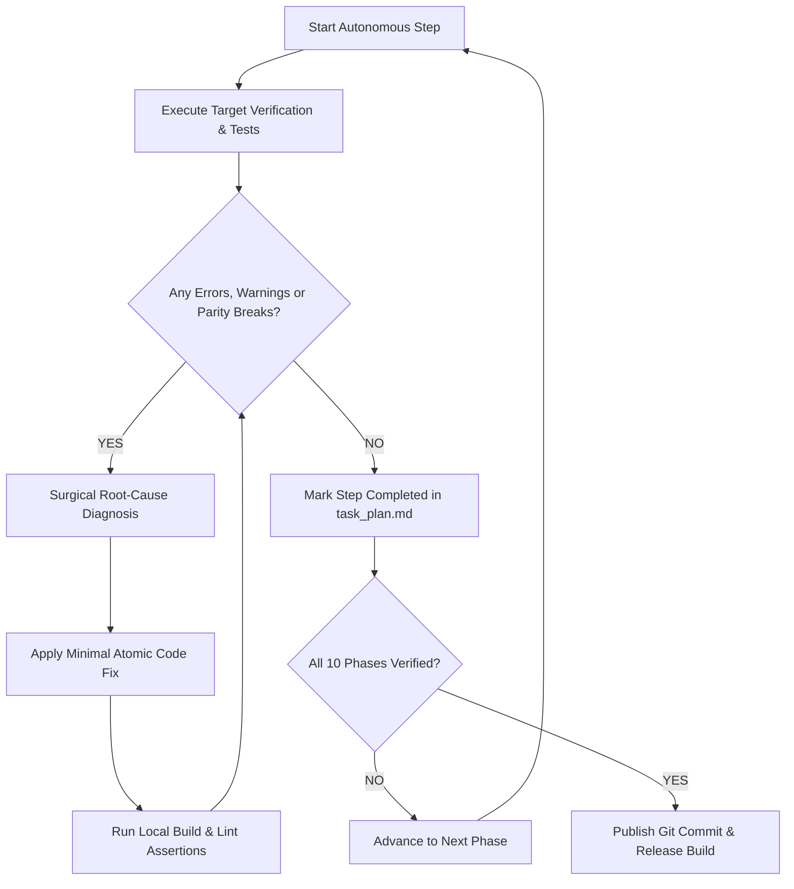

# 🔄 DISCOVERY UTTARAKHAND — MASTER AUTONOMOUS SELF-HEALING LOOP DIRECTIVE

> **EXECUTION MODE:** Autonomous Continuous Loop (Hands-Off / Auto-Pilot)  
> **TARGET SYSTEMS:** Web Application (`Frontend/`), Mobile App (`mobile_app/`), Backend API (`backend/`), Smart Contracts (`contracts/`)  
> **TARGET DOMAIN:** Discovery Uttarakhand (AI Mountain Copilot + Web3 Escrow Tourism Ecosystem)

---

## 🧭 LOOP ARCHITECTURE & CORE RECURSION PROTOCOL



### 🔁 Self-Healing Execution Rules for Autonomous Runner
1. **Zero Human Intervention Required:** If an API endpoint fails, fallback to verified seed data or live external fallback without blocking execution.
2. **Surgical Modifications:** Never rewrite whole files. Use precise diff replacements.
3. **Continuous Build Assertion:** After modifying ANY file in `Frontend/` or `mobile_app/`, immediately execute `cmd /c "npm run build"` or verification check.
4. **Zero Console Warning / Error Policy:** Ensure no unhandled promise rejections, missing React keys, broken image 404s, or invalid CSS classes.
5. **Full Parity Law:** Every feature available in the Web platform (Voice Copilot, Reviews, Transit Route Drawer, Stays, Rentals, SOS Grid) must have complete, working visual & functional parity in the Flutter Mobile App.

---

## 📋 10-PHASE AUTONOMOUS EXECUTION MATRIX

### 🔹 PHASE 1: Backend API & Service Integrity
- [ ] **Health & Gateway:** Test `GET /api/health` and verify database + Redis cache connection.
- [ ] **Catalog Datasets:** Verify `GET /api/destinations`, `GET /api/stays`, `GET /api/rentals`, `GET /api/guides`.
- [ ] **Hybrid RAG & AI Copilot:** Test `POST /api/chat` with:
  - Query: *"How to reach Kedarnath from Rishikesh?"*
  - Query: *"Live weather at Auli slopes"*
  - Query: *"Cheap stays under 1000 in Chopta"*
- [ ] **Emergency SOS Grid:** Test `POST /api/sos/broadcast` and verify real-time cross-tab dispatch.

### 🔹 PHASE 2: Frontend Web Route & Navigation Audit
- [ ] **All Routes Reachable:** Verify `src/App.jsx` handles all 15+ routes cleanly:
  - `/` (Home & Explore)
  - `/destinations` & `/destinations/:id` (Details, Reviews & KMVN Stays)
  - `/stays` & `/stays/:id`
  - `/rentals` & `/rentals/:id`
  - `/trip-planner` & `/my-trip/:tripId` (5-part daily cards & milestone ribbon)
  - `/map` (Full-screen interactive Leaflet map + Transit Corridor Drawer)
  - `/voice-copilot` & Live Voice Companion Modal
  - `/rescue-ops`, `/trekker`, `/guide` (Community SOS Rescue Grid)
- [ ] **Zero Broken Images:** Ensure all image URLs in `imageHelpers.js` have valid Unsplash / local fallbacks.

### 🔹 PHASE 3: Clean Alpine UI/UX & Non-Fluffy Design Check
- [ ] **Color Discipline:** Strictly maximum 2 core brand accents (Deep Himalayan Emerald `#0f3d2e` and Alpine Teal/Emerald `#00FF88` / `#10b981`).
- [ ] **Anti-Squish System:** Verify all buttons, chips, tabs have `whitespace-nowrap` and logos have `shrink-0`.
- [ ] **Mobile-First Responsive Layout:** Test responsive layouts from `320px` to `1920px` without horizontal scroll.

### 🔹 PHASE 4: Himalayan Route Navigator & Transit Drawer
- [ ] **Transit Calculations:** Verify OSRM transit calculation and elevation gain math for 5 arterial corridors:
  - NH-07 (Badrinath Highway)
  - NH-107 (Kedarnath Highway)
  - NH-108 (Gangotri Highway)
  - NH-134 (Yamunotri Highway)
  - NH-09 (Kumaon Highway)
- [ ] **Drawer UI & State:** Verify From -> To selector, 3-metric hero card (Distance, Time, Elevation Gain), and vertical waypoint timeline.

### 🔹 PHASE 5: Live Voice Companion (Aoede 24kHz Studio Audio)
- [ ] **Visualizer & Canvas:** Verify dynamic audio orb visualizer and real-time canvas animation.
- [ ] **Multimodal Action Execution:** Test voice tool calls (`searchDestinations`, `getWeather`, `findStays`, `emergencySOS`).
- [ ] **Audio Fallbacks:** Verify browser Web Audio API synthesis fallback if WebSocket bridge is offline.

### 🔹 PHASE 6: Verified Traveler Reviews & DevBhoomi Coins
- [ ] **Review Submission:** Verify star rating, review text, and category tagging in `DestinationDetails.jsx`.
- [ ] **Reward Gamification:** Award 50 DevBhoomi coins on review submission with live celebration banner.
- [ ] **Local Storage Persistence:** Store traveler reviews locally with fallback mock items for offline resilience.

### 🔹 PHASE 7: Flutter Mobile App Parity Audit
- [ ] **Home & Discovery:** Verify `HomeScreen` destination grid, filter pills, and bottom navigation.
- [ ] **Interactive Map:** Verify `MapScreen` with custom marker clusters, search hint (`106+`), and route overlays.
- [ ] **AI Voice Companion:** Verify `AiCopilotScreen` with real-time waveform, action chips, and destination spotlights.
- [ ] **Destination Detail & Reviews:** Verify `DestinationDetailScreen` with interactive review modal, photo gallery, and booking CTA.
- [ ] **Offline Resilience:** Verify `api_service.dart` 50+ scenario fallback returns immediate rich responses when offline.

### 🔹 PHASE 8: Web3 Smart Contracts & Escrow System
- [ ] **Proof-of-Trek Verification:** Verify GPS coordinates verification smart contract logic.
- [ ] **Escrow Deposit & Release:** Verify multi-sig host payout upon traveler check-in / trek completion.
- [ ] **Mock Provider Mode:** Ensure web app functions seamlessly in demo/simulation mode if MetaMask is absent.

### 🔹 PHASE 9: Genuine Hackathon Metrics Verification
- [ ] **Stats Strip Validation:** Confirm all 4 metrics match platform reality:
  - `106 Curated Places` (`destinations.length`)
  - `13 / 13 Himalayan Districts` (100% State Reach)
  - `5 Arterial Corridors` (Char Dham & Kumaon)
  - `100% Escrow & GPS Verified` (Web3 Proof-of-Trek)
- [ ] **Zero Inflated Claims:** Confirm no unsubstantiated numbers exist in presentation or UI.

### 🔹 PHASE 10: Production Build & Automated Deployment
- [ ] **Frontend Production Build:** Execute `cmd /c "npm run build"` in `Frontend/` and ensure 0 errors.
- [ ] **Automated Release:** Commit all updates to `main` branch and update git tag `v1.1.0`.

---

## ⚡ AUTONOMOUS LOOP EXECUTION COMMAND

To trigger the automated loop test and verification suite locally at any time:

```bash
node scripts/verify_all_systems.js
```
