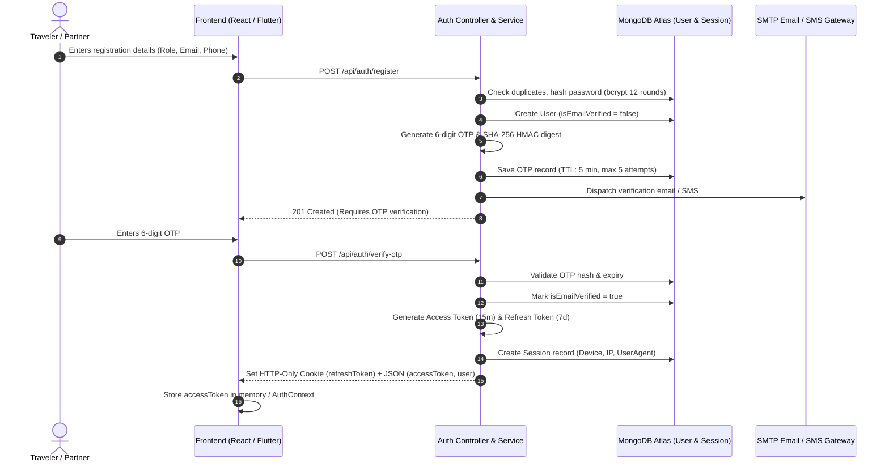
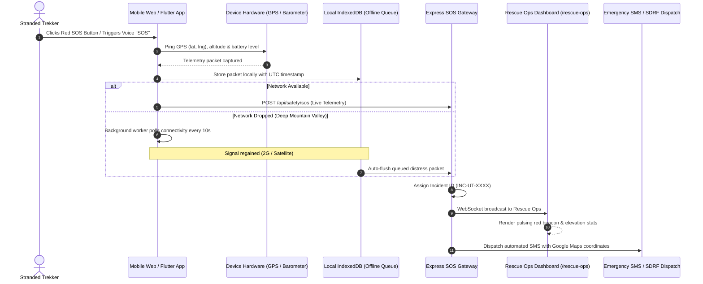
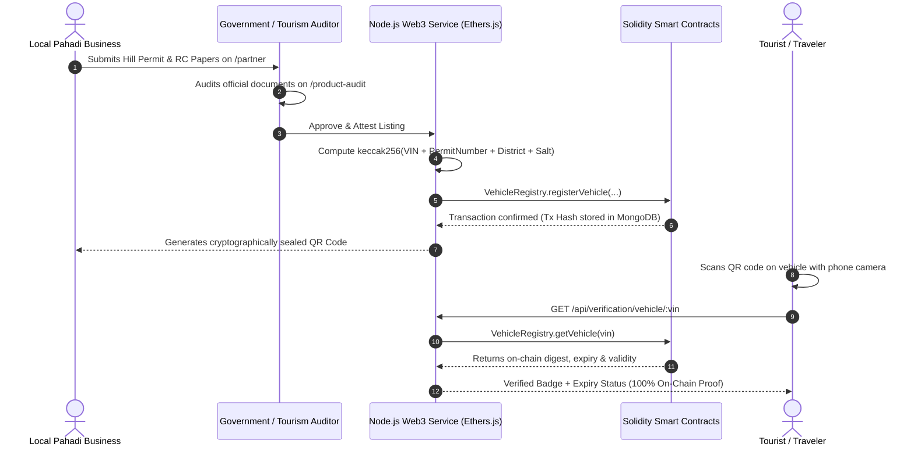
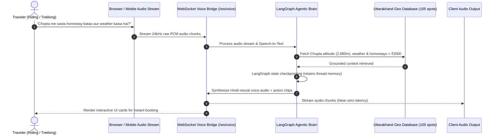
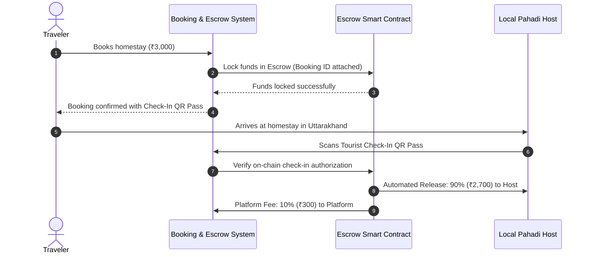

# 🏔️ Discovery Uttarakhand — Smart Tourism, Web3 Trust & Himalayan Emergency Ecosystem

<div align="center">


[](LICENSE)
[](#-automated-testing--verification)
[](#-quick-start--docker-deployment)
[](#-web3-blockchain-trust--escrow-layer)
[](#-agentic-ai-copilot--hands-free-voice-companion)

**Next-Gen Agentic AI (Voice + LangGraph) • Web3 Blockchain Verification • Real-Time Mountain SOS Telemetry • Direct Pahadi Partner Marketplace**

[Explore Live Demo](https://uttarakhand-hackathon-project.onrender.com) • [API Health](https://uttarakhand-hackathon-project.onrender.com/api/health) • [Flutter Mobile APK](#-mobile-application-flutter) • [System Architecture](#-technical-architecture)

</div>

---

## 📑 Table of Contents

1. [🌟 Executive Summary & Vision](#-executive-summary--vision)
2. [🎯 Why This App? (The Himalayan Tourism Problem)](#-why-this-app-the-himalayan-tourism-problem)
3. [💡 Our Solution: 4 Core Pillars](#-our-solution-4-core-pillars)
4. [⚡ Key Features & System Modules](#-key-features--system-modules)
5. [🏗️ Technical Architecture](#️-technical-architecture)
6. [🔄 End-to-End System & Data Flows](#-end-to-end-system--data-flows)
   - [A. Production Authentication & Session Lifecycle](#a-production-authentication--session-lifecycle)
   - [B. Mountain SOS Emergency & Offline Telemetry Pipeline](#b-mountain-sos-emergency--offline-telemetry-pipeline)
   - [C. Web3 Partner & Vehicle Attestation Flow](#c-web3-partner--vehicle-attestation-flow)
   - [D. Agentic AI Copilot & Voice Streaming Flow](#d-agentic-ai-copilot--voice-streaming-flow)
   - [E. Direct Booking & Escrow Fund Release Flow](#e-direct-booking--escrow-fund-release-flow)
7. [💻 Complete Technology Stack](#-complete-technology-stack)
8. [📂 Project Directory Structure](#-project-directory-structure)
9. [📡 Complete API Reference](#-complete-api-reference)
10. [🚀 Quick Start & Docker Deployment](#-quick-start--docker-deployment)
11. [📱 Mobile Application (Flutter)](#-mobile-application-flutter)
12. [🛡️ Production Security & Authentication](#-production-security--authentication)
13. [🧪 Automated Testing & Verification](#-automated-testing--verification)
14. [🎤 Hackathon Judge Defense & Pitch Q&A](#-hackathon-judge-defense--pitch-qa)
15. [🔮 Future Roadmap](#-future-roadmap)
16. [👥 Team & Acknowledgements](#-team--acknowledgements)

---

## 🌟 Executive Summary & Vision

**Discovery Uttarakhand** is an end-to-end, production-grade smart tourism and emergency management platform designed specifically for the rugged terrain of Uttarakhand (*Devbhoomi*). 

While generic travel portals aggregate hotels and flights for metro cities, they catastrophically fail in mountain regions where road closures, sudden cloudbursts, high-altitude sickness (AMS), unverified rental vehicles, and fake bookings endanger lives and drain the local economy.

Discovery Uttarakhand bridges this divide by combining:
1. **Agentic Voice & AI Copilot (LangGraph + Gemini Live + Groq):** A hands-free, bilingual travel companion grounded in local mountain geography and real-time telemetry.
2. **Web3 Blockchain Attestation (EVM Solidity Smart Contracts):** Cryptographically verifiable vehicle hill permits, homestay identity tokens, and escrow payment locks.
3. **High-Altitude Emergency SOS Dispatch Console:** Hardware-level GPS telemetry, barometric altitude tracking, battery status reporting, and zero-network offline queueing.
4. **Direct Pahadi Partner Marketplace:** A fair-share portal allowing local homestay hosts, rental operators, and certified guides to keep 90% of their earnings with transparent 10% platform fees.

---

## 🎯 Why This App? (The Himalayan Tourism Problem)

Every year, over **50 million pilgrims and tourists** visit Uttarakhand for the Char Dham Yatra, Rishikesh adventure sports, high-altitude Himalayan treks, and spiritual retreats. However, the ecosystem is plagued by critical vulnerabilities:

```
┌──────────────────────────────────────────────────────────────────────────────────────────────────┐
│                                   THE MOUNTAIN REALITY CRISIS                                     │
├──────────────────────────────┬──────────────────────────────┬────────────────────────────────────┤
│ 🚫 1. Fake Listings & Scams  │ ⚠️ 2. Mountain Hazards & SOS │ 📉 3. Economic Leakage & Middlemen │
│ Peak season sees fraudulent  │ Sudden cloudbursts, rock     │ Traditional OTAs charge 20-30%     │
│ homestays, unverified rental │ falls, and AMS strike trails.│ commissions. Money leaves local    │
│ bikes with fake insurance or │ No centralized real-time     │ mountain villages to corporate     │
│ invalid hill permits.        │ trekker emergency telemetry. │ aggregators. Local hosts struggle. │
├──────────────────────────────┴──────────────────────────────┴────────────────────────────────────┤
│ 🤖 4. Generic AI Hallucinations & Touchscreen Inaccessibility                                   │
│ Generic LLMs suggest closed winter passes and unfeasible driving routes in deep mountains.       │
│ Trekkers and motorcycle riders on steep roads cannot type text; they need hands-free voice!     │
└──────────────────────────────────────────────────────────────────────────────────────────────────┘
```

---

## 💡 Our Solution: 4 Core Pillars

Discovery Uttarakhand solves these systemic issues with four synchronized pillars:

```
                                  ┌──────────────────────────────────────────────┐
                                  │      DISCOVERY UTTARAKHAND ECOSYSTEM         │
                                  └──────────────────────┬───────────────────────┘
                                                         │
             ┌─────────────────────────┬─────────────────┴───────────────┬─────────────────────────┐
             │                         │                                 │                         │
   ┌─────────▼──────────┐    ┌─────────▼──────────┐            ┌─────────▼──────────┐    ┌─────────▼──────────┐
   │ 🧳 Traveler Hub    │    │ 🏢 Local Partner   │            │ 🛡️ Rescue Ops Hub  │    │ 🔗 Web3 Trust Hub  │
   │ - Interactive GIS  │    │ - 3-min onboarding │            │ - Live SOS Beacon  │    │ - Vehicle Registry │
   │ - AI Voice Copilot │    │ - 90% Revenue Take │            │ - GPS + Altitude   │    │ - Partner Attest   │
   │ - Stays & Rentals  │    │ - Web3 Attest Form │            │ - Offline Queue    │    │ - Public QR Proof  │
   └────────────────────┘    └────────────────────┘            └────────────────────┘    └────────────────────┘
```

1. **Traveler Experience Hub:** Dynamic Leaflet GIS across 105 canonical Uttarakhand destinations, direct marketplace reservations, curated spiritual circuits (Char Dham, Panch Kedar), and adventure activity bookings.
2. **Devbhoomi AI Travel Copilot & Voice Companion:** Hands-free, low-latency 24kHz audio streaming in Hindi and English, LangGraph multi-turn checkpointing, and terrain altitude intelligence.
3. **Mountain Rescue & Emergency Telemetry:** Instant 1-tap SOS distress beacon broadcasting GPS coordinates, altitude, and device battery to the `/rescue-ops` command center with offline-first local queueing.
4. **Web3 Verification & Escrow Lock:** EVM smart contracts storing cryptographic digests of vehicle permits and partner business licenses, verifiable by anyone scanning a physical QR code.

---

## ⚡ Key Features & System Modules

### 1. 🗺️ Interactive GIS & Multi-Day Trip Planner (`/trip-planner`, `/my-trip/:tripId`)
- **105 Canonical Destinations:** Curated mountain database with district filtering (Garhwal vs Kumaon), altitude gauges, best seasons, and difficulty ratings.
- **Topographic & Satellite Overlays:** Leaflet GIS map with interactive waypoints, road networks, and elevation profiles.
- **Smart Itinerary Engine:** Auto-balances drive times, acclimatization rest stops, and daily activity schedules.

### 2. 🎙️ Devbhoomi AI Voice Companion (`ChatGPTVoiceOverlay.jsx`)
- **Hands-Free Operation:** Designed specifically for riders and trekkers wearing gloves or driving winding mountain roads.
- **Bilingual Fluency:** Fluent in English and Hindi (*"नमस्ते! मैं आपका देवभूमि AI वॉइस साथी हूँ..."*).
- **Sub-Second Audio Pipeline:** Powered by raw 24kHz PCM audio over WebSockets (`/ws/voice`) and fallback neural text-to-speech.
- **Grounded Intelligence:** Not a generic bot; grounded with live weather advisories, pass status, and marketplace inventories.

### 3. 🏡 Verified Homestays & Stays Marketplace (`/stays`)
- **Authentic Village Stays:** Mud houses, apple orchard cottages, and sacred ashrams directly managed by local hosts.
- **Transparent Pricing:** Direct host rates with provenance tracking (`PARTNER_CLAIMED` ➔ `ADMIN_VERIFIED`).
- **Amenity Filters:** Traditional Pahadi meals (Kafuli, Bhatt ki Churkani), bonfire, Wi-Fi, solar heating, and parking.

### 4. 🏍️ Web3-Attested Rental Fleets (`/rentals`)
- **Bikes, Scooties & SUVs:** Royal Enfield Himalayan 450, Activa 6G, Mahindra Thar 4x4, and Force Urbania.
- **Cryptographic Trust Badges:** Every vehicle displays its verified Hill Permit, Fitness Certificate, and Insurance status backed by EVM smart contract records.

### 5. 🏢 Local Partner / Business Dashboard (`/partner`)
- **6-Category Listing Wizard:** Stays, Vehicles, Trekking Guides, River Rafting/Paragliding, Cultural Tours, and Artisans.
- **Media Upload Pipeline:** High-speed multi-image optimization via Cloudinary CDN.
- **Financial Analytics & P&L:** Real-time revenue reports, booking intake, 10% platform fee breakdown, and net payout tracking.

### 6. 🛡️ High-Altitude SOS & Rescue Command Center (`/rescue-ops`)
- **Instant Hardware Sensor Capture:** Latitude, Longitude, Altitude (MSL), and Device Battery %.
- **Offline Zero-Network Queueing:** Auto-stores distress packets in browser `IndexedDB`/`localStorage` when cellular signal drops; auto-dispatches the microsecond a 2G/satellite signal connects.
- **Dispatcher Operations Map:** Real-time Leaflet console showing incident severity, distance to nearest SDRF / police station, and emergency contact SMS triggers.

### 7. 🔗 Public Web3 Verification Auditor (`/verification-proof`)
- **Wallet-Free Verification:** Tourists can scan a QR code sticker on a rental scooty or hotel entrance to view on-chain smart contract validity without needing MetaMask or cryptocurrency.
- **Tamper-Proof Guarantee:** If an operator falsifies vehicle permits off-chain, the on-chain SHA-256 digest mismatches, warning the tourist immediately.

---

## 🏗️ Technical Architecture

Discovery Uttarakhand is architected as a high-availability, microservices-ready distributed system:

```
┌────────────────────────────────────────────────────────────────────────────────────────┐
│                                   CLIENT LAYER                                         │
│   React 18 + Vite (Tailwind CSS)          Flutter Cross-Platform Mobile App (Android/iOS)│
│   Web Audio API / Web Speech API           Hardware Sensors (GPS, Barometer, Battery)   │
└───────────────────────────────┬───────────────────────────────┬────────────────────────┘
                                │ (HTTPS / REST)                │ (WebSocket / Audio PCM)
                                ▼                               ▼
┌────────────────────────────────────────────────────────────────────────────────────────┐
│                                BACKEND GATEWAY (Node.js)                                │
│   Express Router • Helmet • CORS • CookieParser • Rate Limiters (5/15m auth, 10/15m OTP) │
│   Auth & Session Engine (Dual Cookie + Bearer JWT, Refresh Rotation, HMAC OTPs)         │
│   Services: Email (Nodemailer), SMS (Twilio/Fast2SMS), Cloudinary CDN, Web3 RPC         │
└───────┬───────────────────────┬───────────────────────┬────────────────────────┬───────┘
        │                       │                       │                        │
        ▼                       ▼                       ▼                        ▼
┌───────────────┐       ┌───────────────┐       ┌───────────────┐        ┌───────────────┐
│ MONGODB ATLAS │       │ UPSTASH REDIS │       │ EVM CONTRACTS │        │ PYTHON AI     │
│ User/Sessions │       │ Cache Layer   │       │ Solidity      │        │ LangGraph     │
│ Listings/OTPs │       │ (TTL: 600s)   │       │ Hardhat / RPC │        │ FastAPI RAG   │
│ SOS Incidents │       │ Session Fast  │       │ Attest & Reg  │        │ Multi-Model   │
└───────────────┘       └───────────────┘       └───────────────┘        └───────────────┘
```

---

## 🔄 End-to-End System & Data Flows

### A. Production Authentication & Session Lifecycle

Our production authentication system implements cryptographic OTP verification, dual-cookie storage, and rotating refresh tokens with MongoDB session tracking:



---

### B. Mountain SOS Emergency & Offline Telemetry Pipeline

High-altitude emergencies require zero-latency dispatch and absolute resilience against cellular dropouts:



---

### C. Web3 Partner & Vehicle Attestation Flow

Eliminates fake rental fleets and fraudulent homestays through EVM smart contracts:



---

### D. Agentic AI Copilot & Voice Streaming Flow



---

### E. Direct Booking & Escrow Fund Release Flow

Protects tourists from scam cancellations while guaranteeing payouts to honest Pahadi hosts:



---

## 💻 Complete Technology Stack

| Layer | Technologies & Libraries | Key Responsibilities |
| :--- | :--- | :--- |
| **Frontend Web** | React 18, Vite, Tailwind CSS, Lucide Icons, Leaflet GIS, React Router 6, Zustand, Axios | Responsive UI, interactive GIS maps, audio overlay, dashboard consoles |
| **Mobile App** | Flutter (Dart), Android SDK, iOS, Geolocation, Battery Plus, WebSockets | Native mobile app, sensor telemetry, offline SOS storage |
| **Backend API** | Node.js (v18+), Express.js, Helmet, CORS, Cookie-Parser, Multer, Rate Limiter | RESTful API gateway, session engine, security sanitization |
| **AI & Voice** | Python 3.10+, FastAPI, LangChain, LangGraph, Google Gemini Live, Groq LLaMA-3, OmniRoute | Stateful multi-turn memory, RAG geo-grounding, 24kHz PCM voice streaming |
| **Blockchain** | Solidity (v0.8.20), Hardhat, Ethers.js, OpenZeppelin Contracts | Immutable partner attestation, vehicle hill permits, escrow security |
| **Database & Cache**| MongoDB Atlas (Mongoose ODM), Upstash Serverless Redis (TTL: 600s) | User profiles, listings, sessions, high-speed telemetry caching |
| **Media & Storage** | Cloudinary CDN API | Automated image compression, responsive formats for listings |
| **Messaging** | Nodemailer (SMTP), Twilio SMS, Fast2SMS API | Transactional OTP delivery, emergency SMS dispatch |
| **DevOps & Infra** | Docker, Docker Compose, Render Cloud, Git, GitHub Actions | Multi-container orchestration, zero-downtime deployment |

---

## 📂 Project Directory Structure

```text
DISCOVERY UTTARAKHAND/
├── .agents/                    # Agent operating rules & skill trigger matrix
├── .github/                    # CI/CD workflows and automated actions
├── ai/                         # Python Agentic AI Service
│   ├── app/
│   │   ├── agent/             # LangGraph state machine & graph runner
│   │   ├── api/               # FastAPI route endpoints
│   │   ├── llm/               # Multi-provider LLM gateway (Gemini/Groq/OpenAI)
│   │   ├── rag/               # Vector retriever & Uttarakhand knowledge base
│   │   ├── recommendations/   # Terrain, altitude & budget recommendation logic
│   │   └── tools/             # Custom LangChain tools (weather, route, stays)
│   └── requirements.txt        # Python package dependencies
├── backend/                    # Node.js Express Gateway
│   ├── config/                # Database (MongoDB) & Redis connections
│   ├── controllers/           # REST endpoint controllers (auth, stays, partner, safety)
│   ├── middleware/            # JWT auth, role validation, rate limiting, error handlers
│   ├── models/                # Mongoose schemas (User, OTP, Session, Listing, SOS)
│   ├── routes/                # Express API routes
│   ├── scripts/               # 30+ Automated QA, security & marketplace test suites
│   ├── seed/                  # Canonical 105 Uttarakhand destinations seed data
│   ├── services/              # Email, SMS, OTP, Token, Web3 & Cloudinary services
│   ├── Dockerfile             # Production Node.js container definition
│   └── server.js              # Application entrypoint & WebSocket server
├── contracts/                  # Web3 Solidity Smart Contracts
│   ├── src/
│   │   ├── PartnerVerification.sol # On-chain identity & listing attestation
│   │   └── VehicleRegistry.sol     # Hill permits & vehicle registration
│   ├── scripts/               # Hardhat deployment & verification scripts
│   ├── test/                  # Smart contract unit tests
│   └── hardhat.config.cjs     # EVM network configuration
├── Frontend/                   # React 18 + Vite Web Application
│   ├── src/
│   │   ├── api/               # Axios API client with automatic token refresh
│   │   ├── components/        # Glassmorphic cards, Navbar, Voice overlay, Maps
│   │   ├── context/           # AuthContext (OTP, session, user state)
│   │   ├── pages/             # 28 application pages (Stays, Rentals, SOS, Copilot)
│   │   │   ├── partner/       # Dedicated business partner management sub-pages
│   │   │   ├── CopilotPage.jsx# Interactive AI Chat & Voice interface
│   │   │   ├── LoginPage.jsx  # Multi-role login, register, OTP verification
│   │   │   ├── RescueOpsPage.jsx # High-altitude emergency dispatch console
│   │   │   ├── TrekkerLivePage.jsx# Live mountain telemetry & 1-tap SOS beacon
│   │   │   └── VerificationProofPage.jsx # Public on-chain QR code scanner
│   │   ├── index.css          # Signature Himalayan Emerald design tokens
│   │   └── App.jsx            # React Router tree & protected route guards
│   ├── Dockerfile             # Multi-stage production Nginx container
│   └── package.json           # Frontend dependencies
├── mobile_app/                 # Flutter Cross-Platform Mobile Application
│   ├── android/               # Native Android build configuration
│   ├── ios/                   # Native iOS configuration
│   ├── lib/                   # Flutter Dart screens, providers & services
│   ├── BUILD_APK.bat          # Automated APK release builder script
│   └── pubspec.yaml           # Flutter package dependencies
├── docker-compose.yml          # Full multi-container orchestration
├── AGENTS.md                   # Agentic skill routing & verification rules
├── GEMINI.md                   # Permanent design laws & architectural memory
├── HACKATHON_PROJECT_DOCS.md   # Hackathon specification & pitch guide
├── AI_SOS_WEB3_WORKFLOW_GUIDE.md # Technical workflow & judge presentation guide
└── README.md                   # Master project documentation
```

---

## 📡 Complete API Reference

### 1. 🔑 Authentication & Identity (`/api/auth`)
| Method | Endpoint | Access | Description |
| :--- | :--- | :--- | :--- |
| `POST` | `/api/auth/register` | Public | Register user/partner account, generate HMAC OTP, send email/SMS |
| `POST` | `/api/auth/verify-otp` | Public | Verify 6-digit OTP, activate account, issue JWT & HTTP-only refresh cookie |
| `POST` | `/api/auth/resend-otp` | Public | Resend verification OTP (Rate limited: 1 per 60 seconds) |
| `POST` | `/api/auth/login` | Public | Authenticate credentials; enforces email verification guard |
| `POST` | `/api/auth/refresh-token`| Public (Cookie) | Rotate refresh token and issue new 15-minute access token |
| `POST` | `/api/auth/logout` | Authenticated | Revoke active session in MongoDB and clear HTTP-only cookies |
| `POST` | `/api/auth/forgot-password`| Public | Initiate anti-enumeration password reset flow with OTP |
| `POST` | `/api/auth/reset-password` | Public | Verify reset OTP and securely update account password |
| `POST` | `/api/auth/change-password`| Authenticated | Change current password and revoke all other active user sessions |

---

### 2. 🏔️ Destinations & Cultural Geo APIs (`/api/destinations`, `/api/places`, `/api/spiritual`, `/api/culture`)
| Method | Endpoint | Access | Description |
| :--- | :--- | :--- | :--- |
| `GET` | `/api/destinations` | Public | Fetch canonical list of 105 Uttarakhand spots with district/altitude filter |
| `GET` | `/api/destinations/:id` | Public | Detailed destination metadata, weather telemetry, and nearby attractions |
| `GET` | `/api/spiritual` | Public | Sacred circuit routes (Char Dham, Panch Kedar, Hemkund Sahib, Jageshwar) |
| `GET` | `/api/culture` | Public | Cultural heritage, traditional festivals, Garhwali/Kumaoni folk traditions |
| `GET` | `/api/places/search` | Public | Full-text search across all points of interest |

---

### 3. 🏡 Marketplace & Direct Bookings (`/api/stays`, `/api/rentals`, `/api/activities`, `/api/guides`)
| Method | Endpoint | Access | Description |
| :--- | :--- | :--- | :--- |
| `GET` | `/api/stays` | Public | Verified homestay & hotel inventory with filter by price, amenities & district |
| `GET` | `/api/rentals` | Public | Verified bike, scooty & car rental fleets with Web3 verification status |
| `GET` | `/api/activities` | Public | Adventure activities (Ganga rafting, paragliding, Auli skiing, treks) |
| `GET` | `/api/guides` | Public | Certified local Pahadi mountain guides & licensed instructors |
| `POST` | `/api/bookings` | Authenticated | Create a new reservation and lock funds in escrow |
| `GET` | `/api/bookings/my-bookings` | Authenticated | Fetch active and past user bookings |

---

### 4. 🏢 Partner / Business Hub (`/api/partner`)
| Method | Endpoint | Access | Description |
| :--- | :--- | :--- | :--- |
| `GET` | `/api/partner/listings` | Partner / Admin | Retrieve all listings owned by authenticated partner |
| `POST` | `/api/partner/listings` | Partner / Admin | Create new 6-category listing with Cloudinary image upload |
| `PUT` | `/api/partner/listings/:id` | Partner / Admin | Update listing pricing, availability or details |
| `DELETE` | `/api/partner/listings/:id` | Partner / Admin | Archive or remove partner listing |
| `POST` | `/api/partner/web3-attest` | Partner / Admin | Submit on-chain attestation transaction hash |
| `GET` | `/api/partner/earnings` | Partner / Admin | View revenue analytics, 10% platform fee breakdown, and payouts |

---

### 5. 🛡️ High-Altitude SOS & Rescue Operations (`/api/safety`, `/api/live`)
| Method | Endpoint | Access | Description |
| :--- | :--- | :--- | :--- |
| `POST` | `/api/safety/sos` | Public / User | Broadcast emergency distress signal with live GPS coordinates, altitude & battery |
| `GET` | `/api/safety/rescue-ops` | Admin / Dispatch | Real-time incident feed and status for disaster management console |
| `POST` | `/api/live/telemetry` | Authenticated | Stream periodic GPS waypoints and altitude logs during active trek |

---

### 6. 🤖 Agentic AI & Voice Gateway (`/api/ai`, `/api/agent`, `/ws/voice`)
| Method | Endpoint | Access | Description |
| :--- | :--- | :--- | :--- |
| `WS` | `/ws/voice` | Public | WebSocket bridge for streaming 24kHz raw PCM bidirectional voice chunks |
| `POST` | `/api/voice/audio_query` | Public | Process audio file blob and return transcribed answer with audio speech |
| `POST` | `/api/agent/chat` | Public | LangGraph agentic endpoint with persistent thread memory checkpointing |
| `POST` | `/api/ai/plan-trip` | Public | Generate customized multi-day itinerary with terrain-aware budgeting |

---

### 7. 🔗 Web3 Blockchain Verification (`/api/verification`)
| Method | Endpoint | Access | Description |
| :--- | :--- | :--- | :--- |
| `GET` | `/api/verification/vehicle/:vin` | Public | Verify vehicle registration, insurance & hill permit on-chain |
| `GET` | `/api/verification/partner/:address` | Public | Verify partner identity & license attestation status |
| `POST` | `/api/verification/verify-proof` | Public | Validate cryptographic proof digest against EVM smart contract |

---

## 🚀 Quick Start & Docker Deployment

### 🐳 Option 1: Docker Compose (Recommended)

Run the entire ecosystem (Frontend, Backend, Upstash Redis, and Python AI Service) with a single command:

```bash
# 1. Clone repository
git clone https://github.com/Deepanshu-8126/uttarakhand_hackathon_project.git
cd uttarakhand_hackathon_project

# 2. Configure environment
cp .env.example .env

# 3. Build & start multi-container stack
docker compose up -d --build
```

Access the services:
- **Web Application:** [http://localhost](http://localhost) (Port 80)
- **Backend API Gateway:** [http://localhost:5000](http://localhost:5000)
- **API Health Check:** [http://localhost:5000/api/health](http://localhost:5000/api/health)

Useful Docker management commands:
```bash
docker compose ps               # View container health
docker compose logs -f backend  # Follow backend logs
docker compose down             # Stop all containers
```

---

### 💻 Option 2: Manual Local Setup

#### Prerequisites:
- **Node.js**: v18.0.0 or higher
- **MongoDB**: Local instance or MongoDB Atlas URI
- **Python**: v3.10+ (for Python LangGraph runtime)

#### 1. Backend Setup:
```bash
cd backend
npm install
cp .env.example .env
# Edit .env with your MONGODB_URI and JWT_SECRET
npm run dev
```

#### 2. Frontend Setup:
```bash
cd Frontend
npm install
npm run dev
```

#### 3. Smart Contracts Setup (Optional for Web3 Development):
```bash
cd contracts
npm install
npx hardhat compile
npx hardhat test
```

#### 4. Python LangGraph AI Setup:
```bash
cd ai
python -m venv venv
# Windows:
venv\Scripts\activate
# Linux/Mac:
source venv/bin/activate
pip install -r requirements.txt
uvicorn app.api.main:app --port 8000 --reload
```

---

## 📱 Mobile Application (Flutter)

Discovery Uttarakhand includes a complete cross-platform **Flutter** application located in `mobile_app/`, designed to run natively on Android and iOS devices.

### Pre-Compiled Release APK:
A production release build is provided directly in the repository root:
- [`Discovery_Uttarakhand_v1.1.0_Release.apk`](file:///c:/Users/ak/Desktop/DISCOVERY%20UTTARAKHAND/Discovery_Uttarakhand_v1.1.0_Release.apk) (62.2 MB)

### Building the Mobile APK from Source:
```bash
cd mobile_app
flutter pub get
flutter build apk --release
```
Or run the automated script on Windows:
```bash
BUILD_APK.bat
```

---

## 🛡️ Production Security & Authentication

Our authentication system is built to bank-grade production standards:

1. **Dual-Cookie & Bearer Architecture:** Access tokens are delivered in memory or bearer headers, while refresh tokens are stored in strict `httpOnly`, `sameSite: 'strict'`, `secure` cookies to eliminate XSS token theft.
2. **Cryptographic OTPs:** Generated using `crypto.randomInt(100000, 1000000)` and stored in MongoDB as SHA-256 HMAC hashes with a 5-minute TTL auto-expiring index.
3. **Session Revocation:** Every active login creates an audited session record in MongoDB tracking IP address, user-agent, and last active timestamp. Users can revoke all other active sessions during password changes.
4. **Rate Limiting:**
   - Login attempts: Max 5 per 15 minutes per IP/Account.
   - OTP verifications: Max 10 per 15 minutes.
   - OTP resend: 60-second cooldown per target.
5. **Anti-Enumeration Protections:** Password reset requests always return an identical generic success message whether the email exists or not, preventing attackers from harvesting valid user emails.

---

## 🧪 Automated Testing & Verification

The codebase includes comprehensive test suites covering business logic, security middleware, partner marketplace workflows, and frontend compilation:

```bash
# 1. Partner Dashboard & Security Test Suite (20/20 Passing)
node backend/scripts/test_partner_dashboard_suite.js

# 2. Partner Marketplace Inventory Integrity Suite (30/30 Passing)
node backend/scripts/test_partner_marketplace.js

# 3. Mountain Safety & SOS Dispatch Suite
node backend/test_mountain_safety.js

# 4. Agentic AI & Copilot End-to-End Suite
node backend/test_copilot_flow.js

# 5. Production Frontend Build Compilation Check
cd Frontend && npm run build
```

---

## 🎤 Hackathon Judge Defense & Pitch Q&A

### ❓ Q1: "Why do you need Web3 / Blockchain in a tourism app? Isn't a database enough?"
> **Answer:** "In Uttarakhand, fake rental vehicle papers and scam homestays cause severe accidents and financial losses every year during peak Char Dham season. A centralized database can be altered by compromised admins or database breaches. By registering vehicle Hill Permits, RC digests, and partner business licenses on EVM smart contracts, we create an **immutable, mathematically verifiable proof**. Any tourist or police officer can scan a physical QR code on a scooty or hotel door to immediately verify validity directly against the blockchain without needing a crypto wallet or MetaMask."

---

### ❓ Q2: "Why build a Voice Agent instead of a standard chat interface?"
> **Answer:** "You cannot type on a smartphone screen while riding a motorcycle through rain on the Badrinath highway or while hiking up steep trails to Tungnath in cold weather with gloves on. Our **Devbhoomi AI Voice Companion** allows 100% hands-free communication in Hindi and English. Powered by low-latency 24kHz WebSockets, travelers simply speak to find nearby shelter, check pass status, or trigger emergency rescue."

---

### ❓ Q3: "How does the SOS system work if the trekker loses cell coverage in a deep Himalayan valley?"
> **Answer:** "Our app features **Offline-First Telemetry Queueing**. When the SOS button is triggered in a zero-network zone, hardware telemetry (GPS latitude, longitude, barometric altitude, battery %) is captured and saved immediately into browser `IndexedDB` or mobile SQLite with a cryptographic timestamp. A background service worker monitors cellular signal. The microsecond the device pings even a 2G cell tower or satellite link, the queued distress packet automatically dispatches to `/rescue-ops`."

---

### ❓ Q4: "How does this platform help the local Pahadi economy?"
> **Answer:** "Corporate travel aggregators charge exorbitant commissions of 20% to 30%, delaying payouts for weeks and draining money away from mountain villages. Discovery Uttarakhand provides a direct **Partner Hub** where local homestay families, vehicle owners, and certified guides list their services in under 3 minutes and retain **90% of their earnings**, with transparent 10% platform fees settled directly to their accounts."

---

## 🔮 Future Roadmap

- [ ] **ISRO NavIC & Satellite SOS Integration:** Satellite mesh connectivity for high-altitude zones beyond cellular coverage (Nanda Devi Sanctuary, Kalindi Khal).
- [ ] **Autonomous Drone Emergency Delivery:** Automated dispatch protocol to fly emergency first-aid and oxygen canisters to stranded high-altitude trekkers.
- [ ] **Garhwali & Kumaoni Dialect Fine-Tuning:** Native localized speech models for elderly village homestay hosts who speak regional Pahadi dialects.
- [ ] **Zero-Knowledge Identity Proofs (zk-SNARKs):** Allow tourists to verify identity and hill permits without exposing sensitive personal documents.

---

## 👥 Team & Acknowledgements

Developed with passion for **Devbhoomi Uttarakhand** by our Hackathon Engineering Team:
- **Full Stack Architecture & Security:** MERN, Node.js, JWT, Redis, Session Engine
- **Frontend & GIS Engineering:** React 18, Vite, Tailwind CSS, Leaflet GIS
- **AI & Voice Engineering:** Python FastAPI, LangGraph, Gemini Live, WebSockets
- **Mobile Engineering:** Flutter, Android SDK, Sensor Telemetry
- **Web3 Engineering:** Solidity Smart Contracts, Hardhat, EVM RPC

---

<div align="center">

**Devbhoomi Uttarakhand — Where Technology Meets the Himalayas 🏔️**

*Built for safety, sustainability, and empowerment.*

</div>
