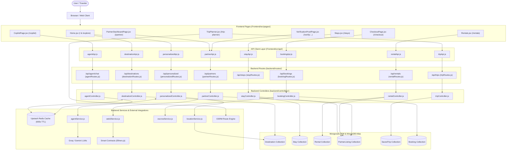

# Discovery Uttarakhand — Complete Master Codebase Graph
**Generated:** 2026-09-28

```mermaid
flowchart TD
    %% User Entry Points
    USER([User / Traveler]) --> WEB[Browser / Web Client]
    
    %% Frontend Pages
    subgraph PAGES ["Frontend Pages (Frontend/src/pages/)"]
        P_HOME["Home.jsx (/ & /explore)"]
        P_STAY["Stays.jsx (/stays)"]
        P_RENT["Rentals.jsx (/rentals)"]
        P_PLAN["TripPlanner.jsx (/trip-planner)"]
        P_COPILOT["CopilotPage.jsx (/copilot)"]
        P_BOOK["CheckoutPage.jsx (/checkout)"]
        P_VERIF["VerificationProofPage.jsx (/verify/...)"]
        P_PARTNER["PartnerDashboardPage.jsx (/partner)"]
    end
    WEB --> PAGES

    %% API Clients
    subgraph APIS ["API Client Layer (Frontend/src/api/)"]
        A_DEST["destinationApi.js"]
        A_STAY["stayApi.js"]
        A_RENT["rentalApi.js"]
        A_TRIP["tripApi.js"]
        A_AGENT["agentApi.js"]
        A_BOOK["bookingApi.js"]
        A_PARTNER["partnerApi.js"]
        A_PERS["personalizedApi.js"]
    end
    P_HOME --> A_DEST
    P_HOME --> A_PERS
    P_STAY --> A_STAY
    P_RENT --> A_RENT
    P_PLAN --> A_TRIP
    P_COPILOT --> A_AGENT
    P_BOOK --> A_BOOK
    P_PARTNER --> A_PARTNER
    P_VERIF --> A_PARTNER

    %% Backend Routes
    subgraph ROUTES ["Backend Routes (backend/routes/)"]
        R_DEST["/api/destinations (destinationRoutes.js)"]
        R_STAY["/api/stays (stayRoutes.js)"]
        R_RENT["/api/rentals (rentalRoutes.js)"]
        R_TRIP["/api/trips (tripRoutes.js)"]
        R_AGENT["/api/agent/chat (agentRoutes.js)"]
        R_BOOK["/api/bookings (bookingRoutes.js)"]
        R_PARTNER["/api/partners (partnerRoutes.js)"]
        R_PERS["/api/personalized (personalizedRoutes.js)"]
    end
    A_DEST --> R_DEST
    A_STAY --> R_STAY
    A_RENT --> R_RENT
    A_TRIP --> R_TRIP
    A_AGENT --> R_AGENT
    A_BOOK --> R_BOOK
    A_PARTNER --> R_PARTNER
    A_PERS --> R_PERS

    %% Controllers
    subgraph CONTROLLERS ["Backend Controllers (backend/controllers/)"]
        C_DEST["destinationController.js"]
        C_STAY["stayController.js"]
        C_RENT["rentalController.js"]
        C_TRIP["tripController.js"]
        C_AGENT["agentController.js"]
        C_BOOK["bookingController.js"]
        C_PARTNER["partnerController.js"]
        C_PERS["personalizedController.js"]
    end
    R_DEST --> C_DEST
    R_STAY --> C_STAY
    R_RENT --> C_RENT
    R_TRIP --> C_TRIP
    R_AGENT --> C_AGENT
    R_BOOK --> C_BOOK
    R_PARTNER --> C_PARTNER
    R_PERS --> C_PERS

    %% Services & External
    subgraph SERVICES ["Backend Services & External Integrations"]
        S_CACHE[("Upstash Redis Cache (600s TTL)")]
        S_AGENT["agentService.js"]
        S_LOC["locationService.js"]
        S_ESCROW["escrowService.js"]
        S_WEB3["web3Service.js"]
        EXT_AI["Groq / Gemini LLMs"]
        EXT_OSRM["OSRM Route Engine"]
        EXT_CHAIN["Smart Contracts (Ethers.js)"]
    end
    C_DEST <--> S_CACHE
    C_PERS <--> S_CACHE
    C_AGENT --> S_AGENT
    S_AGENT --> EXT_AI
    C_PERS --> S_LOC
    C_BOOK --> S_ESCROW
    C_PARTNER --> S_WEB3
    S_WEB3 --> EXT_CHAIN
    P_PLAN --> EXT_OSRM

    %% Models & DB
    subgraph DB ["Mongoose ODM & MongoDB Atlas"]
        M_DEST[("Destination Collection")]
        M_STAY[("Stay Collection")]
        M_RENT[("Rental Collection")]
        M_PARTNER[("PartnerListing Collection")]
        M_TRIP[("SavedTrip Collection")]
        M_BOOK[("Booking Collection")]
    end
    C_DEST --> M_DEST
    C_STAY --> M_STAY
    C_STAY --> M_PARTNER
    C_RENT --> M_RENT
    C_RENT --> M_PARTNER
    C_TRIP --> M_TRIP
    C_BOOK --> M_BOOK
    C_PARTNER --> M_PARTNER
    S_LOC --> M_DEST
```
